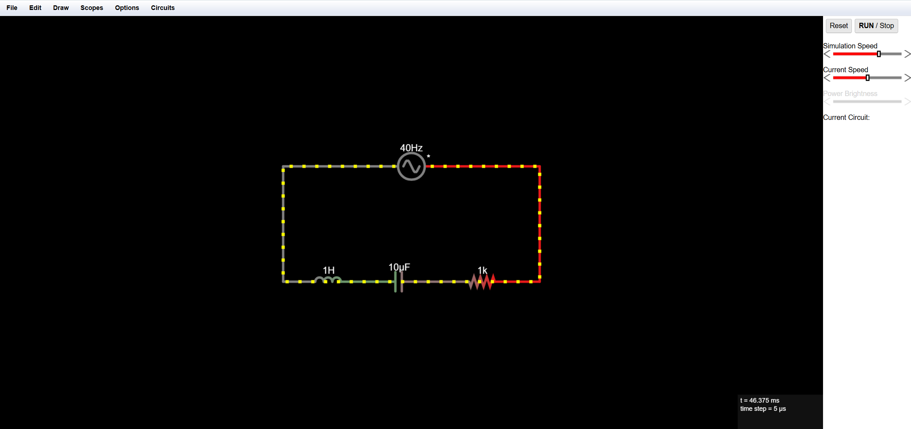

# RLC Series Circuit Simulation 🔁

This project demonstrates a simple **RLC circuit** built using the [Falstad Circuit Simulator](https://falstad.com/circuit/). It consists of:

- AC Source: 40 Hz
- Resistor: 1 kΩ
- Inductor: 1 H
- Capacitor: 10 µF

## Circuit Diagram

## How to Open this Circuit
1. Visit: https://falstad.com/circuit/
2. Click **File > Import**
3. Paste the circuit text from `rlc_circuit.txt` (if included)

## Simulation Output
The circuit demonstrates resonance and phase relationships in AC with R, L, and C components.

---

### Tools Used
- Falstad Circuit Simulator
- Markdown for documentation
